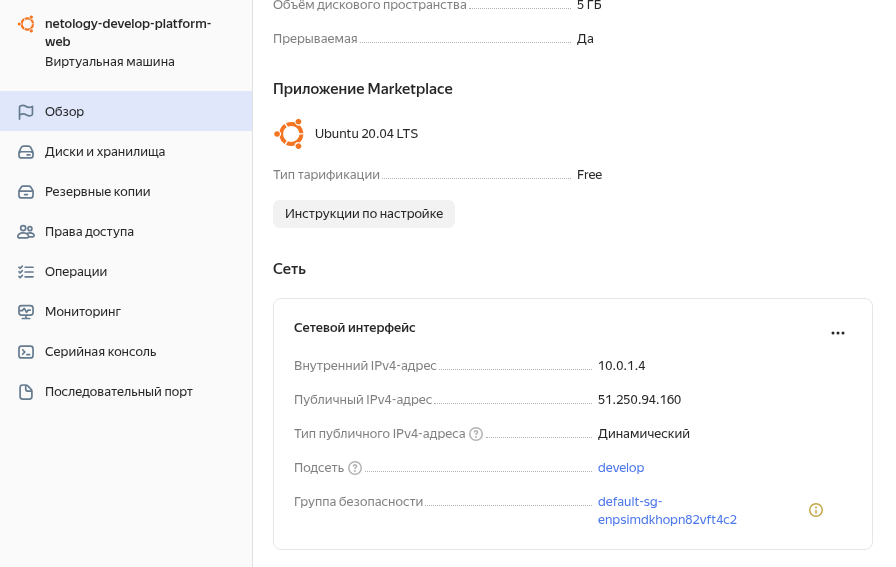
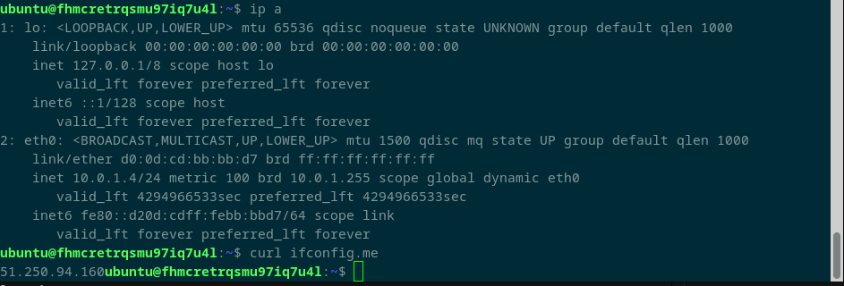
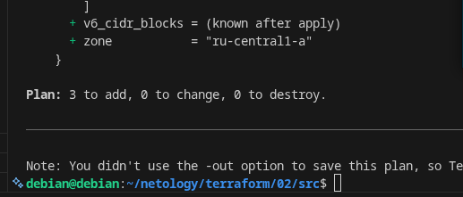
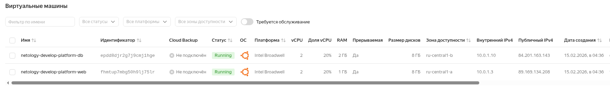
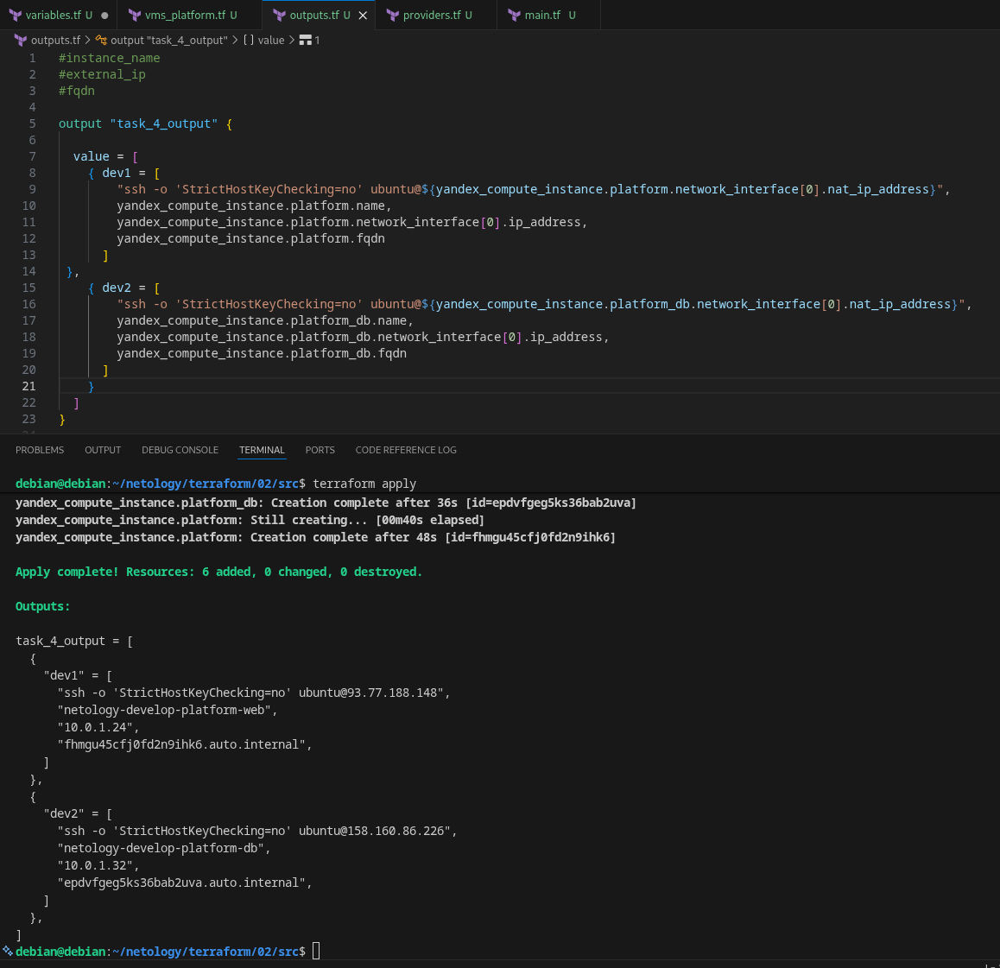
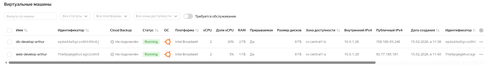

# ter-homeworks-02
homework
  
##Задание 1

4. Изначально ошибка рельно была синтаксическая буква t в platform_id: "standard-v4".  
   Далее выявилось что v4 стандарта в этой зоне нет, был выбран стандарт v3.  
   Так же выявлено, что минимально допустимое количество ядер 2 и доступность можно поставить только 20 для этой зоны и этого стандарта.
    
6. preemptible = true - говорит о прерываемости ВМ  
   core_fraction=5 - 5% процентов vCPU гарантировано  
   оба параметра служат для экономии бюджета  
  
  
Скрины решения:  
  

  

  

  

  
##Задание 2  
  
Скрины решения: Если я правильно понял строчка внизу говорит об отсутствие правок.
  

  

  
##Задание 3
  
>> Долго провозился из за добавления zone в ресурс второй машины
  

  

  
##Задание 4
>>Результат:  
  

  

  
##Задание 5
  
>>Результат  
  

  

  
##Задание 6
  
##Задание 7
  
##Задание 8
  
